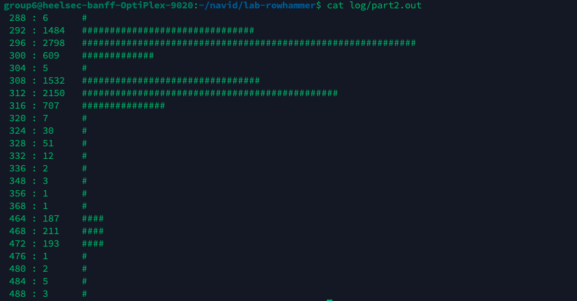

## 1-2

**In a 64-bit system using 4KB pages, which bits are used to represent the page offset, and which are used to represent the page number?**
Page offset: bits `[11:0]` (12 bits).  
Page number (VPN): bits `[63:12]` (52 bits).

**How about for a 64-bit system using 2MB pages? Which bits are used for page number and which are for page offset?**
Page offset: bits `[20:0]` (21 bits).  
Page number (VPN): bits `[63:21]` (43 bits).

**In a 2GB buffer, how many 2MB hugepages are there?**
`2GB / 2MB = 1024`, so there are **1024 hugepages**.

## 2-1

**Given a victim address 0x96ec3000, what is the value of its Row id? The value of its Column id?**
Using `ROW_MASK = 0xFFFE0000` and `COL_MASK = 0x1FFF`:
- Row id = `(0x96ec3000 & 0xFFFE0000) >> 17 = 0x4B76` (19318)
- Column id = `0x96ec3000 & 0x1FFF = 0x1000`

**For the same address, assume an arbitrary XOR function for computing the Bank id, list all possible attacker addresses whose Row id is one more than 0x96ec3000's Row id and all the other ids match, including the Bank id and Column id. Hint: there should be 16 such addresses total.**
Row `+1` adds `0x20000` (since row starts at bit 17), and keeping column fixed keeps the lower 13 bits as `0x1000`.  
The 16 possible attacker addresses (varying bits `[16:13]`) are:

`0x96ee1000, 0x96ee3000, 0x96ee5000, 0x96ee7000,`  
`0x96ee9000, 0x96eeb000, 0x96eed000, 0x96eef000,`  
`0x96ef1000, 0x96ef3000, 0x96ef5000, 0x96ef7000,`  
`0x96ef9000, 0x96efb000, 0x96efd000, 0x96eff000`.

## 2-3

**Analyze the statistics produced by your code when running part2, and report a threshold to distinguish the bank conflict.**

The histogram shows two separated groups:
- Low-latency group (likely non-conflict / different-bank): mostly `288–368` cycles.
- High-latency group (likely bank conflict / same-bank different-row): `464–488` cycles.

A good threshold is **`400 cycles`**. Accesses above this threshold are likely bank conflicts, while accesses below it are likely non-conflicting accesses. Any cutoff between about `368` and `464` cycles would separate the two clusters, but `400` gives a clear margin from both groups.

I used a sample size of 10,000 measurements for this experiment.

## 3-2
**Based on the XOR function you reverse-engineered, determine which of the 16 candidate addresses you derived in Discussion Question 2-1 maps to the same bank.**

The reverse-engineered XOR function is **F0**:

`{A14 ^ A17, A15 ^ A18, A16 ^ A19, A7 ^ A8 ^ A9 ^ A12 ^ A13 ^ A15 ^ A16}`

Using this function, the victim address `0x96ec3000` maps to bank ID `6`. Among the 16 candidate attacker addresses from Discussion Question 2-1, only:

`0x96ee7000`

also maps to bank ID `6`. Therefore, `0x96ee7000` is the candidate address that maps to the same bank as the victim address.

This is because applying F0 to both `0x96ec3000` and `0x96ee7000` produces the same bank ID, `6`.

## 4-2

**Try different data pattern and include the bitflip observation statistics in the table below. Then answer the following questions:**

| Data Pattern (Victim/Aggressor) | `0x00/0xff` | `0xff/0x00` | `0x00/0x00` | `0xff/0xff` |
|---|---:|---:|---:|---:|
| Number of Flips (100 trials) | 111 | 122 | 0 | 10 |

**Do your results match your expectations? What is the best pattern to trigger flips effectively?**

Yes, the results mostly match my expectations. The complementary data patterns caused many more flips than the same-value patterns. This agrees with the idea that setting the victim and aggressor rows to opposite data patterns increases the electrical disturbance between neighboring rows.

The best pattern in my experiment was `0xff/0x00`, with 122 flips across 100 trials. The `0x00/0xff` pattern was also very effective, so the main takeaway is that opposite victim/aggressor patterns trigger flips much more effectively than using the same value in both rows.

## 5-1

**Given the ECC type descriptions listed above, fill in the following table (assuming a data length of 4). For correction/detection, only answer "Yes" if it can always correct/detect (and "No" if there is ever a case where the scheme can fail to correct/detect). We've filled in the first line for you.**

| Code | 1-Repetition (No ECC) | 2-Repetition | 3-Repetition | Single Parity Bit | Hamming(7,4) |
|---|---:|---:|---:|---:|---:|
| Code Rate (Data Bits / Total Bits) | `1.0` | `4/8 = 0.5` | `4/12 = 0.333` | `4/5 = 0.8` | `4/7 = 0.571` |
| Max Number of Errors Can Detect | `0` | `1` | `2` | `1` | `2` |
| Max Number of Errors Can Correct | `0` | `0` | `1` | `0` | `1` |

## 5-3

**When a single bit flip is detected, describe how Hamming(22,16) can correct this error.**

Hamming(22,16) corrects a single bit flip by recomputing the parity bits from the received data and comparing them with the stored parity bits. The XOR of these two 5-bit parity values gives the syndrome. If the syndrome is nonzero and the overall parity is `1`, then there is a single-bit error and the syndrome identifies the position of the flipped bit. The decoder corrects the value by flipping that bit back.

If the syndrome is `0` but the overall parity is `1`, then the error is in the overall parity bit `P5`, so the decoder corrects it by flipping `P5`. If the syndrome is nonzero but the overall parity is `0`, then the code detects a double-bit error, but it cannot safely correct it.

## 5-5

**Can the Hamming(22,16) code we implemented always protect us from rowhammer attacks? If not, describe how a clever attacker could work around this scheme.**

No. Hamming(22,16) can correct one-bit errors and detect two-bit errors, but Rowhammer can induce multiple bit flips within the same codeword. If an attacker causes three or more flips, the ECC may miscorrect the data or fail to detect corruption. A clever attacker can repeatedly hammer memory and use templating to find vulnerable bits, then trigger multiple flips in the same protected word to bypass the single-error correction guarantee.[1,2]

[1]L. Cojocar, K. Razavi, C. Giuffrida and H. Bos, "Exploiting Correcting Codes: On the Effectiveness of ECC Memory Against Rowhammer Attacks," 2019 IEEE Symposium on Security and Privacy (SP), San Francisco, CA, USA, 2019, pp. 55-71, doi: 10.1109/SP.2019.00089.
[2]P. Jattke, V. Van Der Veen, P. Frigo, S. Gunter and K. Razavi, "BLACKSMITH: Scalable Rowhammering in the Frequency Domain," 2022 IEEE Symposium on Security and Privacy (SP), San Francisco, CA, USA, 2022, pp. 716-734, doi: 10.1109/SP46214.2022.9833772.
