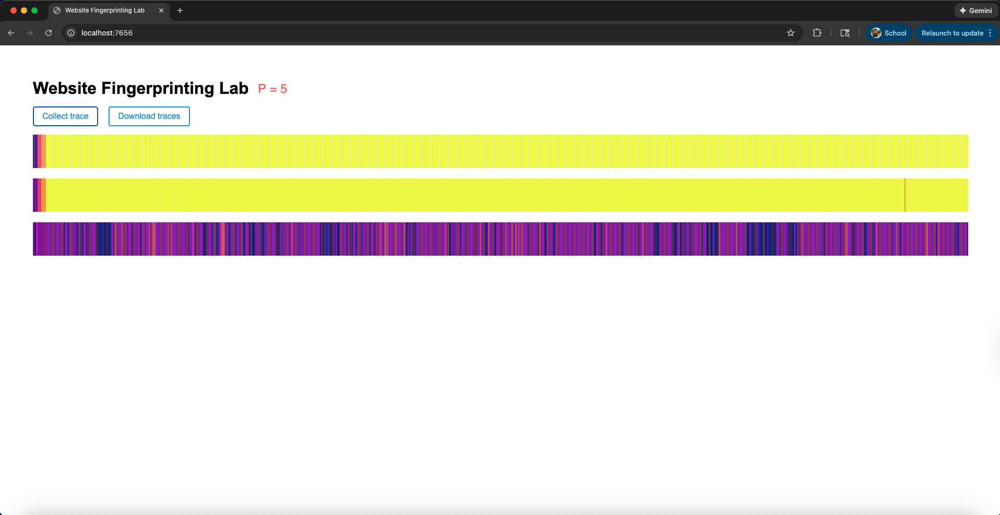

## Optional

**Report your browser version, CPU type, cache size, RAM amount, and OS. We use this information to learn about the attack’s behavior on different machines.**

```
[Browser versions]
Chrome: Google Chrome 144.0.7559.110 
Firefox: Mozilla Firefox 145.0.2
Safari: 18.6

[CPU]
CPU: Apple M4

[Cache line size]
Cache line size: 128 bytes

[Cache sizes]
hw.l1icachesize: 131072 bytes
hw.l1dcachesize: 65536 bytes
hw.l2cachesize: 4194304 bytes
hw.l3cachesize: (not reported)

[Apple Silicon perf-level L2 caches]
hw.perflevel0.l2cachesize: 16777216 bytes
hw.perflevel1.l2cachesize: 4194304 bytes

[RAM]
RAM: 16 GB

[OS]
ProductName:		macOS
ProductVersion:		15.6
BuildVersion:		24G84
```


## 1-2

**Use the values printed on the webpage to find the median access time and report your results as follows.**

| Number of Cache Lines | Median Access Latency (ms) |
| --------------------- | -------------------------- |
| 1                     | 0.0000ms                           |
| 10                    | 0.0000ms                           |
| 100                   | 0.0000ms                           |
| 1,000                 | 0.0000ms                           |
| 10,000                | 0.0000ms                           |
| 100,000               | 0.1000ms                           |
| 1,000,000             | 0.7000ms                           |
| 10,000,000            | 7.4000ms                           |

Region reuse was not used because accessing the same memory region in every run can introduce cache warm-up and reuse effects, which bias timing measurements across runs. Region separation, while reducing cache reuse, was also avoided because it requires memory proportional to `runs × N`, making it impractical for large values of `N`. Instead, a Fisher–Yates shuffle was used to randomize the cache-line access order for each run, minimizing cross-run cache reuse while keeping memory usage fixed and preserving the intended cache-sweeping behavior.

```
N = 10,000,000, LINE_SIZE = 16, runs = 10, Float64 = 8 bytes

Region reuse
= N × LINE_SIZE × 8 = 10,000,000 × 16 × 8 = 1,280,000,000 bytes
≈ 1.28 GB  (≈ 1.192 GiB)

Region separation
= runs × N × LINE_SIZE × 8 = 10 × 10,000,000 × 16 × 8 = 12,800,000,000 bytes
≈ 12.8 GB (≈ 11.921 GiB)

Fisher–Yates shuffle
Data array = N × LINE_SIZE × 8 = 1,280,000,000 bytes  (≈ 1.28 GB)
Index array = N × 4 = 40,000,000 bytes    (≈ 0.04 GB)
Total = 1,320,000,000 bytes ≈ 1.32 GB (≈ 1.229 GiB)
```


## 1-3

**According to your measurement results, what is the resolution of your `performance.now()`? In order to measure differences in time with `performance.now()``, approximately how many cache accesses need to be performed?**

From the measurements, I observe that `performance.now()` reports 0.000 ms up to about 10,000 cache-line accesses. The first clearly non-zero timing appears at 100,000 accesses, around 0.1 ms.

Based on this, the effective timing resolution of `performance.now()` on my machine is about 0.1 ms. To reliably measure a difference in time using `performance.now()`, I need around ~100,000 accesses giving a stable, observable signal.

## 2-2

**Report important parameters used in your attack. For each sweep operation, you access N addresses, and you count the number of sweep operations within a time interval P ms. What values of N and P do you use? How do you choose N? Why do not you choose P to be larger or smaller?**

**Important Parameters:** 
- N (addresses per sweep): 100000 cache-line addresses
- P (time window): 5 ms

**How we choose `N`:**
From our measurements, `performance.now()` stays at 0.000 ms up to about 10000 cache-line accesses, and the first clearly non-zero timing shows up around 100000 accesses (≈ 0.1 ms).
So we pick N = 100000 so that one sweep is long enough to reliably exceed the timer’s effective resolution and produce a stable, measurable signal.

**Why we don't choose P larger or smaller**
- If P is smaller (e.g., 2 ms): many windows contain too few sweeps (sometimes 0–1), so the count becomes noisy/jittery, making traces less consistent.
- If P is larger (e.g., 10+ ms): we get fewer samples over time and the trace becomes over-smoothed, which blurs short-lived changes and reduces fingerprinting detail.
So P = 5 ms is a good balance: stable sweep counts per window, but still fine-grained enough to keep useful temporal structure in the trace.


## 2-3

**Take screenshots of the three traces generated by your attack code and include them in the lab report.**




## 2-4

**Use the Python code we provided in Part 2.1 to analyze simple statistics (mean, median, etc.) on the traces from google.com and nytimes.com. Report the statistic numbers.**

```
Trace Number ---- Domain ----- Samples ----- Mean ----- Median ------ StdDev ------ Min ------ Max
1            ---- google.com ----- 1000    ----- 102.3180 ----- 104.0000 ------   6.4488 ------   9.0000 ------ 107.0000
2            ---- google.com ----- 1000    ----- 102.9130 ----- 104.0000 ------   3.6947 ------  64.0000 ------ 107.0000
3            ---- google.com ----- 1000    ----- 101.6170 ----- 103.0000 ------   5.0798 ------  -1.0000 ------ 107.0000
4            ---- google.com ----- 1000    ----- 102.7380 ----- 104.0000 ------   3.7979 ------  67.0000 ------ 107.0000
5            ---- google.com ----- 1000    ----- 102.8090 ----- 104.0000 ------   3.5740 ------  69.0000 ------ 107.0000
6            ---- nytimes.com ----- 1000    -----  93.1780 -----  97.0000 ------  13.8365 ------  -1.0000 ------ 106.0000
7            ---- nytimes.com ----- 1000    -----  94.5070 -----  97.0000 ------  11.1887 ------  -1.0000 ------ 107.0000
8            ---- nytimes.com ----- 1000    -----  93.8100 -----  97.0000 ------  12.2725 ------  -1.0000 ------ 106.0000
9            ---- nytimes.com ----- 1000    -----  64.8480 -----  68.0000 ------  10.1189 ------  -1.0000 ------  74.0000
10           ---- nytimes.com ----- 1000    ----- 179.3520 ----- 184.5000 ------  19.2422 ------  86.0000 ------ 200.0000
```


## 2-6

**Include your classification results in your report.**

```
                          precision    recall  f1-score   support

   https://www.baidu.com       1.00      0.93      0.96        40
https://www.facebook.com       0.93      1.00      0.96        40
  https://www.google.com       1.00      0.97      0.99        40
 https://www.youtube.com       0.98      1.00      0.99        40

                accuracy                           0.97       160
               macro avg       0.98      0.97      0.97       160
            weighted avg       0.98      0.97      0.97       160
```

**Optional:** In my experiments, the alternative models (SVM, k‑NN, logistic regression, gradient boosting, and MLP) produced poor accuracy compared to the baseline Random Forest. The Random Forest performed best by a wide margin, and the current eval.py implementation achieves an accuracy of 0.97.


## 3-2

**Include your new accuracy results for the modified attack code in your report.**

```

```


## 3-3

**Compare your accuracy numbers between Part 2 and 3. Does the accuracy decrease in Part 3? Do you think that our “cache-occupancy” attack actually exploits a cache side channel? If not, take a guess as to possible root causes of the modified attack.**

