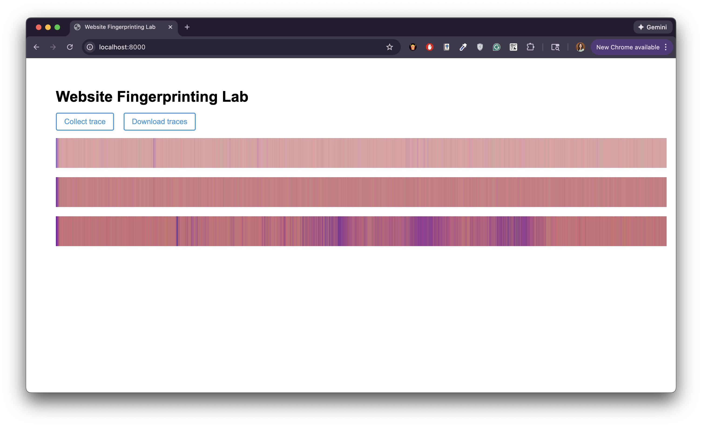

## Optional

**Report your browser version, CPU type, cache size, RAM amount, and OS. We use this information to learn about the attack’s behavior on different machines.**

- Browser: Chrome 143
- CPU: Apple M1
- Cache sizes: hw.l1dcachesize: 65536, hw.l2cachesize: 4194304
- RAM: 16 GB
- OS: MacOS (Catalina)

Cache line size = 128


## 1-2

**Use the values printed on the webpage to find the median access time and report your results as follows.**

| Number of Cache Lines | Median Access Latency (ms) |
| --------------------- | -------------------------- |
| 1                     |  0                          |
| 10                    |  0                          |
| 100                   |  0                          |
| 1,000                 |  0.09999996423721313                          |
| 10,000                |  0.09999999403953552                          |
| 100,000               |  0.3999999761581421                          |
| 1,000,000             |  N/A                          |
| 10,000,000            |  N/A                          |


## 1-3

**According to your measurement results, what is the resolution of your `performance.now()`? In order to measure differences in time with `performance.now()``, approximately how many cache accesses need to be performed?**

The resolution of `performance.now()` is the smallest measurable increment, which is approximately 0.1 ms. Around 1,000 cache accesses need to be performed to measure differences in time.


## 2-2

**Report important parameters used in your attack. For each sweep operation, you access N addresses, and you count the number of sweep operations within a time interval P ms. What values of N and P do you use? How do you choose N? Why do not you choose P to be larger or smaller?**

I used `N = 1,000` and `P = 0.1` as my parameters. I chose `N` based on the number of cache lines that need to be accessed to achieve the smallest measurable increment in the `performance.now()` timer. I chose `P` based on smallest measurable increment determined in in the above question.


## 2-3

**Take screenshots of the three traces generated by your attack code and include them in the lab report.**

1. Do nothing while the trace is collected
2. Add random system activity, moving the mouse during trace collection
3. Open nytimes.com in a new window during trace collection



## 2-4

**Use the Python code we provided in Part 2.1 to analyze simple statistics (mean, median, etc.) on the traces from google.com and nytimes.com. Report the statistic numbers.**

```
Trace 0 (Label: https://www.google.com): Mean=50.95508, Median=47.0, StdDev=26.75408870048853
Trace 1 (Label: https://www.google.com): Mean=50.7806, Median=47.0, StdDev=26.31701623740807
Trace 2 (Label: https://www.google.com): Mean=55.1078, Median=52.0, StdDev=27.82295561510343
Trace 3 (Label: https://www.google.com): Mean=55.30126, Median=52.0, StdDev=27.782945531609638
Trace 4 (Label: https://www.nytimes.com): Mean=40.89368, Median=37.0, StdDev=23.84632751719989
Trace 5 (Label: https://www.nytimes.com): Mean=40.49334, Median=37.0, StdDev=23.884342060111244
Trace 6 (Label: https://www.nytimes.com): Mean=40.47006, Median=37.0, StdDev=23.6288041084685
Trace 7 (Label: https://www.nytimes.com): Mean=31.61256, Median=29.0, StdDev=16.863415141850886
```

## 2-6

**Include your classification results in your report.**

```
                                           precision    recall  f1-score   support

                       https://www.ft.com       0.81      0.93      0.86        41
                https://www.instagram.com       0.74      0.74      0.74        31
https://www.nytimes.com/games/connections       0.97      0.72      0.83        47
               https://www.wellsfargo.com       0.85      0.98      0.91        41

                                 accuracy                           0.84       160
                                macro avg       0.84      0.84      0.84       160
                             weighted avg       0.85      0.84      0.84       160
```


## 3-2

**Include your new accuracy results for the modified attack code in your report.**

```
                                           precision    recall  f1-score   support

                       https://www.ft.com       0.76      0.85      0.80        41
                https://www.instagram.com       0.94      0.94      0.94        31
https://www.nytimes.com/games/connections       0.75      0.70      0.73        47
               https://www.wellsfargo.com       0.85      0.80      0.82        41

                                 accuracy                           0.81       160
                                macro avg       0.82      0.82      0.82       160
                             weighted avg       0.81      0.81      0.81       160
```


## 3-3

**Compare your accuracy numbers between Part 2 and 3. Does the accuracy decrease in Part 3? Do you think that our “cache-occupancy” attack actually exploits a cache side channel? If not, take a guess as to possible root causes of the modified attack.**

The accuracy numbers in Part 3 only slightly decrease, dropping from 0.85 to 0.81. No, based on the similarity in accuracy of classification between the two versions, our attack likely does not exploit a cache side channel. Possible root causes of the modified attack point towards other operating system quirks as we are just counting the number of times the add operation is performed within a time window of length `P`. One such cause could be interrupts.

